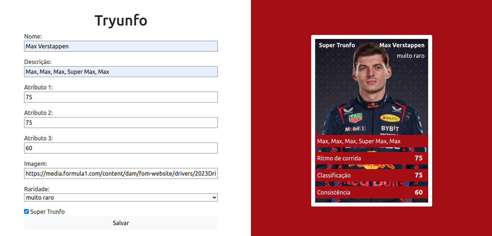

# Bem vindo ao Tryunfo!

O Tryunfo é uma aplicação desenvolvida em React durante a formação em desenvolvimento na Trybe. A aplicação funciona como um CRUD, onde é possível criar, buscar e deletar cartas de trunfo.



## Instalação

Siga estas etapas para configurar o projeto em sua máquina local:

1. Clone o repositório do Tryunfo:

   ```bash
   git clone git@github.com:EwertonJuan/tryunfo.git
   ```

2. Navegue até o diretório do projeto:

   ```bash
   cd tryunfo
   ```

3. Instale as dependências:

   ```bash
   npm install
   ```

4. Inicie o aplicativo:

   ```bash
   npm start
   ```

O aplicativo Tryunfo estará acessível em http://localhost:3000.

## Tecnologias Utilizadas

- React: Biblioteca JavaScript para a construção da interface do usuário.

- CSS: Estilização dos componentes.

- Armazenamento Local: Os dados das cartas são armazenados localmente no navegador.
